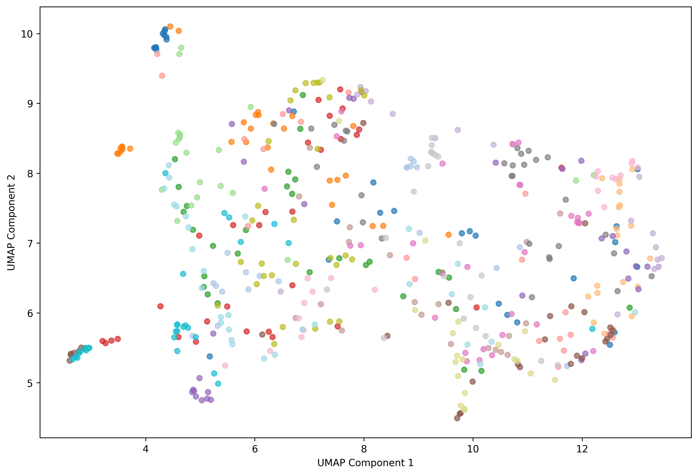
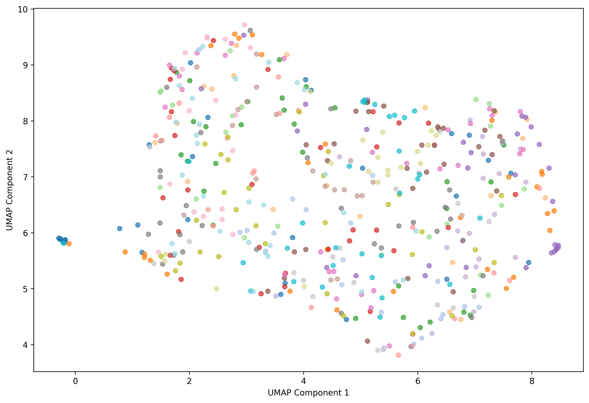

# Few-Shot Adaptation of Vision-Language Models


Few-shot prompt learning for CLIP using **CoOp** and **CoCoOp** on the Oxford Flowers-102 dataset.
The goal is to improve base-class accuracy through learnable soft prompts while preserving zero-shot generalisation on novel classes.

---

## Motivation

Fine-tuning large vision-language models like CLIP on a handful of examples often leads to catastrophic forgetting of unseen categories.
This project implements and compares two prompt-learning strategies that address this trade-off:

| Method | Idea | Trade-off |
|--------|------|-----------|
| **CoOp** | Replace hand-crafted prompts with learnable context vectors | Boosts base accuracy, may hurt novel classes |
| **CoCoOp** | Add a Meta-Network that conditions prompts on each input image | Better novel-class generalisation |

We further enhance CoCoOp with **Gaussian noise regularisation** and **adaptive contrast enhancement** to push the base-novel harmonic mean higher.

---

## Key Results

### UMAP Visualisation of Meta-Net Conditional Tokens

| Without Enhancement | With Enhancement |
|:---:|:---:|
|  |  |

> The adaptive contrast enhancement produces tighter per-class clusters in the Meta-Net token space, improving discriminability.

---

## Architecture Overview

```
Input Image
    |
    v
+------------------+
|  CLIP ViT-B/16   |  (frozen)
|  Image Encoder   |
+------------------+
    |                          +-------------------+
    |  image features          | Learnable Context |
    |                          |    Vectors (ctx)  |
    |                          +-------------------+
    |                                   |
    v                                   v
+------------------+          +-------------------+
|   Meta-Network   |  ------> | Conditional Prompt|  (CoCoOp only)
| (image -> bias)  |  bias    |  ctx + bias       |
+------------------+          +-------------------+
                                        |
                                        v
                              +-------------------+
                              | CLIP Text Encoder |  (frozen)
                              +-------------------+
                                        |
                                        v
                              cosine similarity -> logits -> CE loss
```

**Only the context vectors and the Meta-Network are trained**; the rest of CLIP stays frozen.

---

## Project Structure

```
nn_few_shot/
├── Few_Shot_Learning_CLIP.ipynb   # Main experiment notebook
├── src/                           # Modular source package
│   ├── __init__.py
│   ├── constants.py               # CLASS_NAMES (102 flower categories)
│   ├── data.py                    # Data loading, splitting, MappedDataset
│   ├── models.py                  # TextEncoder, PromptLearner, CoOp, CoCoOp
│   ├── training.py                # Train loop, evaluation, main pipeline
│   ├── visualization.py           # Plotting utilities
│   ├── enhancement.py             # Adaptive contrast enhancement
│   └── analysis.py                # Token extraction, clustering, UMAP
├── img/                           # UMAP visualisation figures
├── runs/                          # TensorBoard logs
├── requirements.txt
├── LICENSE
└── README.md
```

---

## Installation

```bash
git clone https://github.com/AstyanM/nn_few_shot.git
cd nn_few_shot
pip install -r requirements.txt
```

> A CUDA-capable GPU is strongly recommended. Training CoCoOp on CPU is possible but very slow.

---

## Usage

### Run the full experiment notebook

```bash
jupyter notebook Few_Shot_Learning_CLIP.ipynb
```

The notebook walks through:
1. Dataset exploration and class distribution analysis
2. CLIP zero-shot baseline evaluation
3. CoOp training and evaluation (with optional noise regularisation)
4. CoCoOp training with Meta-Network
5. Enhanced CoCoOp with adaptive contrast enhancement
6. UMAP token-space analysis and clustering metrics

### Use the source package directly

```python
from src.data import get_data, base_novel_categories, split_data
from src.models import CoOp, CoCoOp
from src.training import main

# Train CoOp with noise regularisation
model, novel_model, base_acc, novel_acc, zs_base, zs_novel = main(
    model_type="coop",
    n_ctx=16,
    num_epochs=15,
    noise_scale=0.125,
)

# Train CoCoOp
model, novel_model, base_acc, novel_acc, zs_base, zs_novel = main(
    model_type="cocoop",
    n_ctx=16,
    num_epochs=5,
    batch_size=4,
)
```

### Monitor training with TensorBoard

```bash
tensorboard --logdir=runs
```

---

## Technical Details

| Parameter | Value |
|-----------|-------|
| CLIP backbone | ViT-B/16 |
| Dataset | Oxford Flowers-102 |
| Base / Novel split | 51 / 51 classes |
| Training shots per class | 10 |
| Context tokens (`n_ctx`) | 16 |
| Optimiser | SGD (lr=0.002, momentum=0.9) |
| LR schedule (CoOp) | Cosine annealing (T_max=30) |
| Meta-Net hidden dim | `vis_dim // 16` |
| Noise regularisation | Gaussian, scale = 0.125 |
| Enhancement | HSV saturation boost (factor 1.2) |
| Evaluation metric | Harmonic mean of base & novel accuracy |

---

## References

1. Zhou et al., *Learning to Prompt for Vision-Language Models* (CoOp), IJCV 2022
2. Zhou et al., *Conditional Prompt Learning for Vision-Language Models* (CoCoOp), CVPR 2022
3. Radford et al., *Learning Transferable Visual Models From Natural Language Supervision* (CLIP), ICML 2021

---

## Authors

- **Martin Astyan** - [GitHub](https://github.com/AstyanM)
- **Antoine Corby**

Deep Learning 2025 course project.

---

## License

This project is licensed under the MIT License - see the [LICENSE](LICENSE) file for details.
